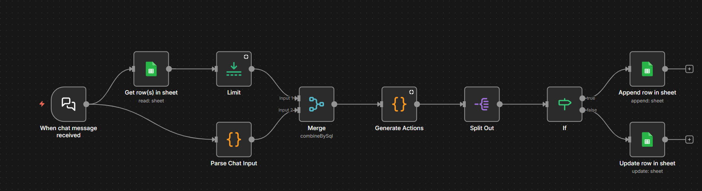

# 📊 Rider Behavior Dataset

> **From Personal Automation to Large-Scale Behavioral Data Collection**  
> A temporal data normalizer that transforms raw odometer readings into structured rider behavior insights

---

## 🎯 The Evolution

**What started as:** A simple personal mileage tracker for daily bike usage  
**What it became:** A **behavioral dataset generator** designed for large-scale rider analysis

Most mileage apps track **events** ("You rode 24 km on Dec 6").  
This project captures **behavior** ("You ride daily, with 7-day idle periods every 3 weeks").

---

## 💡 Current Implementation

**Input Method:** Manual chat interface  
**Processing:** n8n workflow automation  
**Storage:** Google Sheets (structured, queryable)

**Key Feature:** Intelligent temporal normalization handles complex edge cases that break simple trackers.

---

## 🔍 What This Captures

### Not Just Distance—But Patterns

| Metric | What It Reveals |
|--------|----------------|
| **Riding Frequency** | Daily rider vs weekend warrior vs occasional user |
| **Idle Periods** | How long between rides? Seasonal patterns? |
| **Usage Consistency** | Steady commuter or irregular usage? |
| **Distance Patterns** | Short trips vs long rides |
| **Behavior Changes** | When did usage drop? When did it spike? |


---

## 🧠 The Intelligence Behind It

This isn't just data storage—it's a **temporal behavior normalizer** with sophisticated edge case handling.

### Core Logic: The "Smart Date Merger"

**Input:** Raw odometer readings (sometimes daily, sometimes with gaps)  
**Output:** Clean, range-merged, gap-filled behavioral records

#### Example Transformation:

**Raw Input:**
```
Oct 18: 1850 km
Oct 19: 1850 km (no ride)
Oct 20: 1850 km (no ride)
Oct 21: 1895 km (+45 km)
```

**Intelligent Output:**
```
Oct 18 - Oct 20: 1850 km (difference: 0)  ← Merged idle period
Oct 21: 1895 km (difference: 45)         ← New movement
```

---

## ⚙️ The Edge Case Mastery

This workflow handles **9 complex temporal scenarios**:

### 🔄 **1. Date Already in Range** *(Prevent duplicates)*
**Scenario:** Last row covers Oct 20-22, user inputs Oct 22  
**Action:** Update existing row with new km, adjust difference

### 🛑 **2. Same KM, Same Date** *(No movement detected)*
**Scenario:** 2204 km yesterday, 2204 km today  
**Action:** Extend date range (no new row)

### 📅 **3. Same KM, Future Date** *(Continuous idle period)*
**Scenario:** No rides for a week, same odometer  
**Action:** Create/extend range like "Nov 27 - Dec 3 (0 km)"

### 🚀 **4. New KM, Same Day** *(Multiple entries on one day)*
**Scenario:** Morning: 2200 km, Evening: 2215 km  
**Action:** Update same row (not append)

### ➕ **5. New KM, New Day** *(Normal progression)*
**Scenario:** Yesterday 2286 km, today 2310 km  
**Action:** Append new row with +24 km difference

### 🕳️ **6. Skipped Days** *(Missing data gap)*
**Scenario:** Dec 4: 2286 km → Dec 10: 2350 km (no entries between)  
**Action:** 
1. Add idle filler: "Dec 5 - Dec 9: 2286 km (0)"
2. Append movement: "Dec 10: 2350 km (64)"

### ✂️ **7. Trim Idle Range** *(Split idle period when movement detected)*
**Scenario:** Range "Nov 27 - Dec 3 (0 km)", movement on Dec 3  
**Action:**
1. Update: "Nov 27 - Dec 2 (0 km)"
2. Append: "Dec 3: 2286 km (+82)"

### ⏮️ **8. Backward Entry** *(Out-of-sequence input)*
**Scenario:** User enters past date after future dates  
**Action:** Ignore (prevents data corruption)

### 🛡️ **9. Malformed Dates** *(Graceful error handling)*
**Scenario:** Invalid date format or parsing failure  
**Action:** Skip parsing, use current date as fallback

---

## 🏗️ Technical Architecture

### The Pipeline

```
┌─────────────────────┐
│  Chat Interface     │  ← User inputs: "2315" or "2315, Dec 17"
│  (n8n Chat Trigger) │
└──────────┬──────────┘
           │
           ▼
┌─────────────────────┐
│  Input Parser       │  ← Parse km + date
│  (JS Code)          │     Handle date formats
└──────────┬──────────┘
           │
           ├──────────────────────┐
           │                      │
           ▼                      ▼
┌─────────────────────┐  ┌─────────────────┐
│  Fetch Last Row     │  │  Parsed Input   │
│  (Google Sheets)    │  │  (km + date)    │
└──────────┬──────────┘  └────────┬────────┘
           │                      │
           └───────┬──────────────┘
                   ▼
        ┌─────────────────────┐
        │  Decision Engine    │  ← 200+ lines of edge case logic
        │  (JS Code)          │     Detects scenario, plans actions
        └──────────┬──────────┘
                   │
                   ▼
        ┌─────────────────────┐
        │  Split Actions      │  ← Converts to update/append tasks
        └──────────┬──────────┘
                   │
                   ├─────────────┐
                   ▼             ▼
        ┌─────────────┐  ┌─────────────┐
        │  Append Row │  │  Update Row │
        │  (New data) │  │  (Modify)   │
        └─────────────┘  └─────────────┘
                   │             │
                   └──────┬──────┘
                          ▼
                ┌─────────────────────┐
                │  Google Sheets      │
                │  Structured Dataset │
                └─────────────────────┘
```

### Tech Stack
- **n8n**: Workflow automation (self-hosted)
- **Google Sheets**: Structured storage (queryable, shareable)
- **JavaScript**: Custom temporal logic (edge case handling)

---

## 🚀 Setup Instructions

### 1️⃣ Prerequisites
- n8n instance (self-hosted or cloud)
- Google account with Sheets API access
- Google Sheets with columns: `Date`, `km driven so far`, `km difference`

### 2️⃣ Import Workflow
1. Open n8n
2. Import `workflow.json`
3. Configure credentials:
   - Replace `YOUR_GOOGLE_SHEET_ID`
   - Replace `YOUR_CREDENTIAL_ID`
   - Replace `YOUR_WEBHOOK_ID`

### 3️⃣ Configure Google Sheets
Create a sheet with this structure:
```
| Date | km driven so far | km difference |
|------|------------------|---------------|
```

### 4️⃣ Usage
**Simple format:**
```
2315
```
*(Uses today's date)*

**With specific date:**
```
2315, Dec 17
```
or
```
2315, Oct 12
```

---

## 🎯 Use Cases

### 📈 **For Personal Tracking**
- Understand your riding habits
- Track maintenance intervals
- Visualize usage patterns

### 🔬 **For Research**
- Rider behavior analysis
- Usage clustering (daily commuters vs weekend riders)
- Temporal pattern detection
- Anomaly detection (unusual usage spikes/drops)

### 🏢 **For Business Intelligence**
- Showroom analytics (test ride patterns)
- Fleet management insights
- Customer segmentation by usage
- Predictive maintenance models

### 🤖 **For ML/AI**
- Time series forecasting
- Clustering algorithms (user personas)
- Feature engineering for behavior models
- Habit detection systems

---

## 🌟 What Makes This Special

### 1️⃣ **Behavior, Not Events**
Focuses on **patterns** (idle periods, consistency) not just individual rides

### 2️⃣ **Edge Case Mastery**
Handles temporal complexity that breaks most simple trackers

### 3️⃣ **Dataset-First Design**
Built for analysis from day one—not retrofitted later

### 4️⃣ **Production-Ready Architecture**
Clean separation of logic and execution makes system testable and maintainable

---

---

## 📝 Input Format Examples

```
✅ Valid Inputs:
2315                    → Today's date, 2315 km
2315, Dec 17           → Dec 17, 2315 km
1895, Oct 12           → Oct 12, 1895 km

❌ Invalid Inputs:
Dec 17, 2315           → Wrong order
2315km                 → No spaces/units
yesterday, 2315        → No relative dates
```

---

## 🧪 Example Scenarios

### Scenario A: Daily Commuter
```
Input:  2200 (Mon), 2210 (Tue), 2220 (Wed), 2230 (Thu), 2240 (Fri)
Output: 5 rows, consistent 10 km/day pattern
Insight: Regular commuter, likely work-related usage
```

### Scenario B: Weekend Rider
```
Input:  2200 (Mon), 2200 (Sat), 2280 (Sun), 2280 (next Mon)
Output: Mon-Fri idle range (0 km), Sat-Sun movement (+80 km total)
Insight: Leisure rider, weekend usage only
```

### Scenario C: Irregular User
```
Input:  2200 (Jan 1), 2200 (Jan 15), 2350 (Jan 16)
Output: Jan 1-14 idle (0 km), Jan 15 idle, Jan 16 (+150 km)
Insight: Sporadic usage, possible seasonal rider
```

---

## 🔬 Behind the Scenes

### Why This Started
I wanted to track my bike mileage without manual spreadsheets. I built an n8n automation to make it effortless—just type a number, done.

### Why It Evolved
While building it, I realized the **temporal complexity** was fascinating:
- How do you merge consecutive idle days?
- How do you handle gaps in data?
- How do you prevent duplicates?

Solving these edge cases turned a simple tracker into a **data normalization engine** capable of handling real-world messy data inputs.

---


---

## 📖 Technical Deep Dive

### The Decision Engine Logic

The core intelligence is a **200-line JavaScript function** that:

1. **Parses last row** (date, km, difference)
2. **Compares with input** (same day? future day? gap?)
3. **Detects scenario** (one of 9 edge cases)
4. **Plans actions** (update vs append vs both)
5. **Outputs instructions** (JSON array of operations)

**Key insight:** Instead of direct database writes, it returns *declarative actions*:
```javascript
[
  { type: "update", row: 88, date: "Oct 18 - Oct 20", km: 1850, diff: 0 },
  { type: "append", date: "Oct 21", km: 1895, diff: 45 }
]
```

This separation of *logic* and *execution* makes the system:
- Testable
- Debuggable
- Auditable
- Extensible

---

<p align="center">
  <em>Built with 🧠 for understanding riding behavior through temporal data science</em>
</p>

<p align="center">
  <strong>From personal automation to potential large-scale behavioral research</strong>
</p>