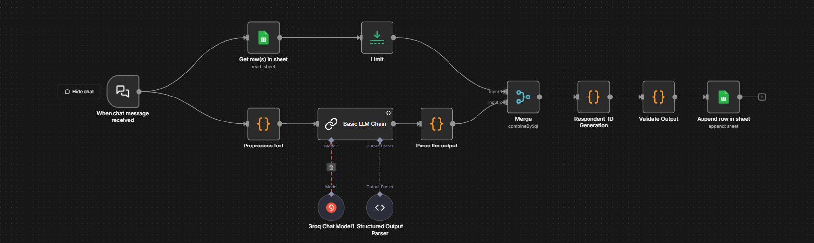

# 🏍️ RBAI Dataset Collection System

> **Decoding the Psychology of Two-Wheeler Riders**  
> Understanding the human behind the handlebars through behavioral science and AI

---

## 🎯 The Big Idea

Ever wondered why some riders meticulously track every service detail while others can't remember their last oil change? Why some people feel a deep emotional bond with their bike while others see it as just transport?

**This is what RBAI explores.**

The **Rider Behavior & Attitude Insight Dataset** captures the invisible patterns that define how people actually relate to their motorcycles—not just the miles they ride, but *why* they ride, *how* they care, and *what* it means to them.

### 🔍 What Makes This Different?

Most motorcycle datasets tell you about:
- 💥 Accidents and violations
- 📊 Sales figures and market trends  
- 🏭 Vehicle specifications

But they miss the **human dimension**:
- 🧠 Do they *know* their bike or just ride it?
- 💚 Do they *love* maintaining it or dread service visits?
- 👨‍👩‍👧‍👦 Does family influence their decisions?
- ⚖️ Are they practical problem-solvers or emotional enthusiasts?

---

## 🧩 Four Dimensions of Rider Psychology

RBAI deconstructs rider behavior into four core dimensions:

### 1️⃣ **Care & Responsibility**
*"Do they respect ownership or just consume it?"*
- Initiative in maintenance decisions
- Proactive vs reactive behavior
- Sense of duty toward the vehicle

### 2️⃣ **Knowledge & Curiosity**
*"Do they understand their machine?"*
- Mechanical awareness
- Learning orientation
- Problem detection ability

### 3️⃣ **Lifestyle & Identity**
*"What role does riding play in their life?"*
- Personal interests (fitness, tech, arts)
- Risk-taking tendencies
- Spending priorities
- Digital habits (AI tools, streaming)

### 4️⃣ **Social Context**
*"Who influences their riding life?"*
- Family bike culture
- Peer dynamics
- Gender perspectives
- Emotional vs practical reasoning

---

## 🚀 What Can You Do With This?

This isn't just data—it's **human insight at scale**.

**🔬 For Researchers:**
- Run Exploratory Factor Analysis to uncover hidden behavioral patterns
- Validate psychological theories about vehicle attachment
- Study gender differences in riding attitudes

**🤖 For AI/ML Engineers:**
- Build conversational agents that understand rider personas
- Train recommendation systems that match products to mindsets
- Create predictive models for maintenance behavior

**📈 For Product Teams:**
- Design services that match rider psychology (not just demographics)
- Segment markets by *behavior*, not just age/income
- Craft messaging that resonates with real motivations

**🎨 For UX Designers:**
- Understand decision-making patterns around vehicle care
- Design interfaces for different knowledge levels
- Build trust with users who delegate vs DIY

---

## 🤔 The Personas You'll Discover

Every rider falls somewhere on the spectrum. Here are the archetypes:

| Persona | Mindset | Behavior Pattern |
|---------|---------|------------------|
| 🔧 **The Enthusiast** | "My bike is my passion" | High knowledge, emotional attachment, DIY culture |
| 📋 **The Pragmatist** | "It's a tool, maintain it well" | Responsible, tracks everything, practical mindset |
| 🤝 **The Delegator** | "Family/mechanic handles it" | Low autonomy, high trust in others, convenience-focused |
| 😌 **The Casual User** | "Just rides, doesn't think much" | Minimal engagement, necessity-driven, low care |
| ✨ **The Aspirational Rider** | "Wants to learn, influenced by trends" | Social motivation, growth mindset, status-aware |
| 🚦 **The Responsible Commuter** | "Daily necessity, keeps it running" | Practical, routine-driven, cost-conscious |

---

## ⚙️ The Tech: How It Works

This is where human insight meets automation. An n8n workflow that transforms raw interview conversations into structured psychological profiles.

### 🎬 The Journey: Transcript → Insight

**Step 1: Chat Interface** 🗣️  
Paste raw interview transcript → System receives unstructured human conversation

**Step 2: Text Preprocessing** 🧹  
Normalize whitespace, clean formatting → Make it LLM-ready

**Step 3: AI Extraction** 🧠  
Groq Llama 3.3 70B analyzes the conversation → Extracts 52 behavioral attributes

**Step 4: Schema Validation** ✅  
JSON schema enforcement → Ensures data quality and type correctness

**Step 5: Intelligence Layer** 🎯  
Auto-generates summary, infers tags, calculates behavior score → Assigns persona

**Step 6: Dataset Integration** 📊  
Appends structured row to Google Sheets → Ready for analysis

### 🏗️ Architecture

```
┌─────────────────────┐
│  Chat Interface     │  ← Paste interview transcript
│  (n8n Chat Trigger) │
└──────────┬──────────┘
           │
           ▼
┌─────────────────────┐
│  Preprocess Text    │  ← Clean whitespace, normalize
└──────────┬──────────┘
           │
           ├──────────────────────┐
           │                      │
           ▼                      ▼
┌─────────────────────┐  ┌─────────────────┐
│  Get Latest Row ID  │  │  Groq LLM       │
│  (Auto-increment)   │  │  Extract Data   │
└──────────┬──────────┘  └────────┬────────┘
           │                      │
           │                      ▼
           │          ┌─────────────────────┐
           │          │  JSON Schema        │
           │          │  Validation         │
           │          └────────┬────────────┘
           │                   │
           └───────┬───────────┘
                   ▼
        ┌─────────────────────┐
        │  Merge & Generate   │
        │  Respondent ID      │
        └──────────┬──────────┘
                   │
                   ▼
        ┌─────────────────────┐
        │  Data Validation    │
        │  (28+ fields check) │
        └──────────┬──────────┘
                   │
                   ▼
        ┌─────────────────────┐
        │  Append to Google   │
        │  Sheets             │
        └─────────────────────┘
```

---

## 🛠️ Setup Guide

Want to run this yourself? Here's how:

### 1️⃣ Get Your Credentials Ready
You'll need:
- 🔐 **Google Sheets OAuth2** (for storing the dataset)
- 🤖 **LLM API Key** (Groq/OpenAI/Anthropic—your choice)

### 2️⃣ Configure the Workflow
Open `workflow.json` and replace:
```
YOUR_GOOGLE_SHEET_ID   → Your actual Google Sheet ID
YOUR_CREDENTIAL_ID     → Your n8n credential reference
YOUR_WEBHOOK_ID        → Generated by n8n on import
```

### 3️⃣ Customize the AI Prompt
The magic happens in the "Basic LLM Chain" node. Adjust:
- 📝 Extraction rules for your schema
- ✅ Validation thresholds
- 🎯 Persona labeling logic

### 4️⃣ Import & Test
1. Drop `workflow.json` into n8n
2. Connect your credentials
3. Test with a sample interview
4. Watch the automation magic happen ✨

---

## 📥 Input Format

**What goes in:**
- 💬 Raw interview transcript (conversational text)
- 📅 Metadata: interviewer name, timestamp

**Example:**
```
"I ride a Honda Activa daily to work, about 15 km. I usually get it serviced 
when the mechanic calls me. I don't really track fuel efficiency, but my dad 
used to be really into bikes so I grew up around them..."
```

## 📤 Output Structure

**What comes out:**

### 🧑 Demographics Layer
Age, gender, location, occupation, lifestyle interests

### 🏍️ Vehicle Context
Type, ownership, usage frequency, ride purpose

### 📊 Behavioral Indicators
Maintenance habits, issue awareness, decision autonomy

### ❤️ Attitudinal Scales (1-5)
Responsibility, knowledge interest, emotional attachment, risk-taking

### ✍️ Qualitative Insights
Free-text behavioral notes, attitudinal observations

### 🤖 AI Intelligence
- **Summary**: 2-3 sentence rider profile
- **Tags**: 6-10 behavioral descriptors
- **Score**: Engagement level (0-35)
- **Persona**: Auto-assigned archetype

---

## 📊 The 52-Attribute Schema

This dataset captures **six layers of human-vehicle interaction:**

| Layer | What It Captures | Example Attributes |
|-------|------------------|-------------------|
| 👤 **Demographics & Context** | Who they are & how they live | Age, location, occupation, hobbies, tech usage |
| 🏍️ **Vehicle Ownership** | Their riding profile | Type, ownership, frequency, distance, purpose |
| 🔧 **Observable Behaviors** | What they actually do | Tracks expenses, notices issues, DIY repairs |
| 💭 **Attitudinal Scales** | How they think & feel | Responsibility (1-5), knowledge interest (1-5), emotional attachment |
| ✍️ **Qualitative Insights** | The story behind the numbers | Free-text notes on behavior patterns & mindset |
| 🤖 **AI-Generated Intel** | Machine understanding | Summary, tags, engagement score, persona label |

**Total: 52 structured attributes** capturing the complete psychological-behavioral profile of a rider.

---

## 🔬 Behind the Scenes

This is an **active research project** exploring the intersection of:
- 🧠 Behavioral psychology
- 🤖 Large language models
- 🏍️ Human-vehicle relationships

The full interview methodology, detailed extraction prompts, and scoring algorithms are kept private during data collection. Once the dataset reaches critical mass and analysis is complete, a public version may be released for the research community.

---

## 🎓 Why This Matters

Understanding rider psychology isn't just academic—it has **real-world impact**:

- 🛡️ **Safety**: Match interventions to behavioral profiles, not just demographics
- 🛠️ **Service Design**: Create maintenance programs that align with rider mindsets
- 📱 **Product Development**: Build apps/services that resonate with actual mental models
- 🎯 **Market Segmentation**: Go beyond "young male riders" to "knowledge-curious pragmatists"
- 🌍 **Policy Making**: Design regulations informed by behavioral science, not just statistics

**The future of rider insights isn't more data—it's smarter data.**

---

<p align="center">
  <em>Built with 🧠 for understanding the humans behind the handlebars</em>
</p>